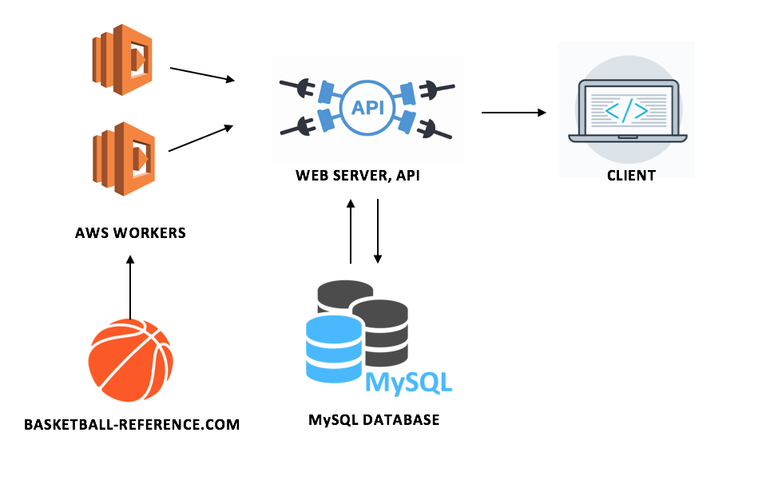

# FantasyBall
Since current Sports API are pay-to-use, I decided to create my own NBA data API by scraping a free website, basketball-reference, so that I could create my FantasyPoint prediction application. The following project is the back-end API that will feed into any future applications I make using Basketball data.

To Run:
- 
- Run `docker-compose up`, injecting required environment variables at runtime 
(build-time will compile but endpoints will fail)  

- If manual docker set-up is desired, run:  
`docker build -t waitress_server:latest .`  
`$ docker run -d -p 5000:5000 waitress_server:latest`

Design Decisions
- 
- Why Flask?
    - Lightweight web framework, does not depend on other libaries like Django does, making it a micro-framework ideal for microservices
- Why MySQL?
    - Since Basketball data is already structured, the main benefit of using a NoSQL DB such as Mongo is eliminated, as its main benefit is to handle large unstructured data

- Deploy on AWS using RDS to set up live MySQL DB instance
- Use Amazon EKS for deployment (TODO: Set up charts and jobs)

Microservice Connection Ideas (TODO)
- 
- Sell API access with API keys (on rapidapi)
- Fantasy point prediction, including ML layer and front-end
- Actual NBA Fantasy Application
